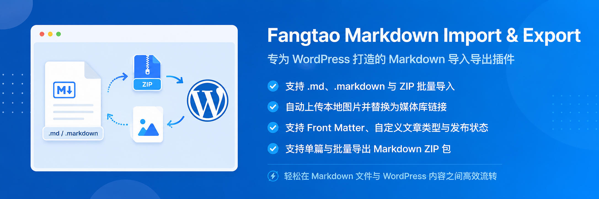

# Fangtao MD IO

[English](README.md) | 简体中文

Fangtao MD IO 是一款用于在 Markdown 文件与 WordPress 之间迁移内容的插件。它可以导入单个 Markdown 文档，也可以导入包含多个 Markdown 文件和本地媒体素材的 ZIP 压缩包；同时支持将单篇或多篇 WordPress 内容导出为便于迁移和备份的 Markdown ZIP。

## 功能特性

- 支持以下 Markdown 文件扩展名（不区分大小写）：.md、.markdown、.mdown、.mkdn、.mkd、.mdwn、.mdtxt、.mdtext、.文本、.txt。
- 导入包含多份 Markdown 文档的 ZIP 压缩包。
- 手动选择 ZIP 中允许导入的安全图片、视频、音频和 PDF 扩展名。
- 将正文引用的本地素材导入 WordPress 媒体库，并自动替换为附件地址。
- 未指定特色图片时，可将首张导入的本地图片设为特色图片。
- 导入时选择目标文章类型、文章状态，并可为普通文章选择分类。
- 设置导入表单默认使用草稿或立即发布。
- 在五种 Markdown 解析器中选择，覆盖传统、GitHub 和 Extra 三种语法风格。
- 保存默认解析器，同时允许每次导入临时切换。
- 可选将远程 HTTP(S) 图片下载到 WordPress 媒体库。
- 默认跟随 PHP 上传限制，也可分别配置 ZIP、解压总量、Markdown、单个素材和文件数量上限。
- 从 Front Matter 导入时间、状态、永久链接、分类、标签和媒体库特色图片 ID。
- 从内容列表的行操作中导出单篇内容。
- 通过 WordPress 批量操作导出多篇内容。
- 按内容类型、分类和标签筛选全部匹配内容，并使用任一受支持的 Markdown 文本扩展名导出。
- 将 WordPress HTML 和区块内容转换为 GitHub Flavored Markdown。
- 将本地媒体库图片写入 `images/`，将本地音视频和 PDF 写入 `media/`，并使用相对路径。
- 在导出的 Markdown 中包含已支持的 Front Matter 元数据。
- OSS 配置完整时保持原有云端流程；检测到 OSS 配置不完整时回退到本地媒体库，避免上传时出现严重错误。

## 运行要求

- WordPress 6.0 或更高版本
- PHP 7.4 或更高版本
- ZIP 导入和导出优先使用 PHP ZIP；缺少该扩展时，两项功能都会回退到 WordPress 自带的 PclZip
- 使用 PclZip 回退时需要 PHP zlib 扩展
- HTML 转 Markdown 导出需要 PHP DOM 扩展
- 建议启用原生 PHP mbstring 以获得更好性能；未启用时插件会使用内置兼容库
- WordPress 上传目录必须可写

导入限制默认读取 PHP 和 WordPress 的有效上传上限。管理员可以为插件设置更低或更高的限制，但 PHP 与 Web 服务器仍可能在请求进入 WordPress 前拦截超大文件。

## 语言适配

Fangtao MD IO 会自动跟随 WordPress 当前站点语言或当前用户的后台语言。中文是默认源语言，插件内置 `en_US` 英文翻译包；其他语言可基于 `languages/fangtao-md-io.pot` 创建翻译文件，无需修改插件代码。

## 安装方法

### 通过 WordPress 后台安装

1. 下载或打包包含 `fangtao-md-io` 目录的插件 ZIP。
2. 打开 **插件 > 安装插件 > 上传插件**。
3. 选择 ZIP 并完成安装。
4. 启用 **Fangtao MD IO**。
5. 在 WordPress 后台打开新增的 **Markdown** 菜单。

### 手动安装

1. 将 `fangtao-md-io` 目录上传到 `wp-content/plugins/`。
2. 在 **插件 > 已安装插件** 中启用插件。

## 导入 Markdown

打开 **Markdown > Markdown 导入**。

1. 选择支持的 Markdown 文本文件或 `.zip` 压缩包。
2. 选择导入到的内容类型。
3. 导入普通文章时，可选择要归入的分类。
4. 选择 **草稿** 或 **立即发布**。
5. 选择 Markdown 解析器。
6. 点击 **上传并导入**。

每个 Markdown 文件会创建一篇新的 WordPress 内容。导入页面支持文章、页面，以及当前用户有权编辑的公开自定义文章类型。

管理员可在页面底部的 **导入设置** 中保存默认文章状态和解析器、选择 ZIP 素材格式、设置导入大小限制，并决定是否导入远程图片。大小填写 `0` 或留空时跟随当前 PHP/WordPress 上传限制；远程图片导入默认关闭。

### Markdown 解析器

导入器包含五种解析器，覆盖三种 Markdown 语法风格：

- **Parsedown** - GitHub 风格
- **Parsedown Extra** - Extra 风格
- **Cebe Markdown** - 传统风格
- **Cebe Markdown GitHub** - GitHub 风格
- **Cebe Markdown Extra** - Extra 风格

所有解析结果写入数据库前都会经过 WordPress 内容清理，Parsedown 系列同时启用安全模式。

### 导入单个 Markdown

不依赖本地资源的 Markdown 文件可以直接上传。远程图片地址默认保持原样，管理员开启远程图片导入后才会下载到媒体库。

### 导入 ZIP

将 Markdown 和本地素材按相对目录一起打包：

```text
articles/
  living-room.md
  images/
    living-room.jpg
  media/
    room-tour.mp4
```

在 Markdown 中使用相对于文档的图片路径：

```markdown

```

导入时，支持的本地图片会进入 WordPress 媒体库，生成内容中的图片引用也会同步更新。

下载类素材使用普通 Markdown 链接，需要播放的视频或音频使用 WordPress 短代码：

```markdown
[下载目录](media/catalog.pdf)
[video src="media/room-tour.mp4"]
[audio src="media/interview.mp3"]
```

只有正文实际引用的素材才会进入媒体库。即使开放格式配置，可执行文件也始终不会被接受。

## Front Matter

导入器支持安全的单行 YAML 风格 Front Matter 子集：

```yaml
---
title: 安静舒适的客厅
slug: calm-living-room
excerpt: 一份打造安静舒适空间的实用指南。
date: 2026-07-10T12:00:00+08:00
status: draft
categories: 家具资讯, 选购指南
tags: 橡木, 客厅
featured_image: images/cover.jpg
---
```

| 字段 | 导入 | 导出 | 说明 |
| --- | --- | --- | --- |
| `title` | 支持 | 支持 | 未填写时使用首个一级标题或文件名。 |
| `slug` | 支持 | 支持 | 设置 WordPress 文章别名。 |
| `permalink` | 支持 | 支持 | 未填写 `slug` 时，使用永久链接最后一段作为文章别名。 |
| `excerpt` | 支持 | 支持 | 导入时也兼容 `description`。 |
| `featured_image` | 支持 | 支持 | 可使用压缩包路径、媒体库 URL、启用后的远程 URL 或附件 ID；兼容 `cover` 和 `image`。 |
| `featured_image_id` | 支持 | 不导出 | 使用现有媒体库图片附件。 |
| `date` | 支持 | 支持 | 按 WordPress 站点时区保存 PHP 可识别的日期。 |
| `categories` | 支持 | 支持 | 普通文章的分类名称或 ID，逗号分隔；兼容 `category`。 |
| `tags` | 支持 | 支持 | 普通文章的标签名称，逗号分隔；兼容 `tag`。 |
| `post_type` | 在界面选择 | 支持 | 导入目标由导入表单控制。 |
| `status` | 支持 | 支持 | 支持 draft、pending、private、publish、future，并受当前用户权限限制。 |

暂不支持复杂或嵌套 YAML 值。

## 导出 Markdown

打开 **Markdown > Markdown 导出**，可以查看支持导出的内容类型。

导出页面可以按内容类型导出全部匹配内容；普通文章还可按分类和标签筛选，并选择任一受支持的 Markdown 文本扩展名。

### 单篇导出

1. 打开任意 WordPress 内容列表。
2. 将鼠标悬停在需要导出的内容上。
3. 点击 **导出 Markdown**。

下载的 ZIP 结构如下：

```text
article.md
images/
  article-image.jpg
```

### 批量导出

1. 打开 WordPress 内容列表。
2. 勾选多篇内容。
3. 在 **批量操作** 中选择 **导出 Markdown ZIP**。
4. 点击应用。

每篇内容会使用独立目录：

```text
article-one-123/
  article.md
  images/
article-two-456/
  article.md
  images/
```

属于当前 WordPress 上传目录的图片会复制到对应的 `images/` 目录。外部图片继续保留外部 URL。

## 支持的内容结构

转换器支持常见 WordPress 内容，包括：

- 标题和段落
- 粗体、斜体和删除线
- 链接和图片
- 有序列表和无序列表
- 引用
- 行内代码和代码块
- GitHub Flavored Markdown 表格
- 图片说明
- 基础音频、视频和嵌入媒体链接

导出前会处理短代码。复杂区块或第三方短代码生成的 HTML 在转换为 Markdown 时可能会被简化。

## 导入限制与安全

导入器包含以下安全限制：

- ZIP、解压总量、Markdown 和单个素材默认跟随 PHP/WordPress 有效上传限制，也可由管理员填写 MB 值
- ZIP 文件数量默认最多 500 个，可手动配置到 10,000 个
- 只解压管理员从安全图片、视频、音频和 PDF 白名单中勾选的扩展名
- 拒绝 ZIP 目录穿越和符号链接
- 忽略不支持的压缩包文件
- 导入后的 HTML 会经过 WordPress 清理
- 导入导出操作均检查 WordPress 权限和 nonce

## 当前限制

- 暂不提供 Markdown 编辑器和实时预览。
- 暂未在 Gutenberg 或经典编辑器侧边栏提供工具。
- 暂不包含内部文档管理系统和 REST API。
- 复杂页面构建器生成的 HTML 无法保证无损转换为 Markdown。

## 常见问题

### 没有 PHP ZIP 扩展时可以导入 ZIP 吗？

可以。导入器会优先使用 PHP ZIP 扩展；服务器未启用该扩展时，会自动改用 WordPress 自带的 PclZip。

### 没有 PHP mbstring 扩展时可以导入 Markdown 吗？

可以。插件已内置 mbstring 兼容库，服务器没有原生扩展时也能转换 Markdown。为了获得更好的性能，仍建议在条件允许时启用原生 mbstring。

### 为什么无法使用导出功能？

HTML 转 Markdown 需要 PHP DOM 扩展。创建 ZIP 时需要 PHP ZIP，或者 WordPress PclZip 与 PHP zlib 组成的回退方案。

### 为什么导入图片保存在本地而不是 OSS？

如果检测到 OSS 插件已启用，但 Bucket、AccessKey 或角色配置不完整，导入器会使用 WordPress 默认本地媒体库，避免出现致命上传错误。完整配置 OSS 后即可恢复其正常处理流程。

### 为什么图片仍然是外部地址？

远程图片默认保留原地址。管理员可在 **导入设置** 中开启 **自动导入远程图片**；下载会经过 WordPress 安全 HTTP 与媒体库流程，并遵循已配置的单个素材大小限制。

### 导入时会覆盖已有文章吗？

不会。每个 Markdown 文档都会创建一篇新内容。

## 更新记录

### 1.8.0

- 新增识别 WordPress 站点和用户语言的英文翻译包，并提供翻译模板。
- 修复后台 Markdown 菜单图标与标题未居中的问题。
- 导入完成前校验图片附件元数据，避免媒体库留下持续上传中的项目。
- 将 GitHub 文档移动到 `docs/`，并在打包时排除 `.gitattributes`。

### 1.7.0

- 增加可配置的安全 ZIP 素材格式，覆盖图片、视频、音频和 PDF 文档。
- 支持导入普通链接及 WordPress 视频/音频短代码引用的本地素材，并替换为媒体库地址。
- 增加 ZIP、解压总量、Markdown、单个素材和文件数量限制，默认跟随 PHP/WordPress 上传限制。
- 导出时将受支持的本地链接素材写入 ZIP 的 `media/` 目录。

### 1.6.1

- WordPress 备用 ZIP 解压现在只释放已校验的 Markdown 和图片，避免无关压缩内容耗尽临时磁盘。
- 按实际写入字节执行直接上传、单文件、解压总量和远程下载大小限制。
- 导入操作必须具备媒体库上传权限；导出时禁止读取 WordPress uploads 目录之外的本地文件。
- Parsedown 从 1.7.4 升级至 1.8.0，修复已报告的正则表达式拒绝服务问题。

### 1.6.0

- 插件名称、目录、主文件、后台页面 slug、文本域和 Composer 包名统一更名为 Fangtao MD IO（`fangtao-md-io`）。
- 保留已有 `ftmzi_*` 设置键和内部标识，升级后继续沿用原有配置。

### 1.5.1

- 新增以下 Markdown 文件扩展名的导入、ZIP 内识别与导出支持（不区分大小写）：.md、.markdown、.mdown、.mkdn、.mkd、.mdwn、.mdtxt、.mdtext、.文本、.txt。

### 1.5.0

- 增加 Parsedown、Parsedown Extra、Cebe Markdown、Cebe Markdown GitHub 和 Cebe Markdown Extra 五种可选解析器。
- 增加传统、GitHub、Extra 三种风格标识，并在切换解析器时实时显示当前风格。
- 增加可持久保存的默认解析器，并支持单次导入临时切换。
- 将解析器依赖随插件打包，迁移到其他 WordPress 站点时无需再运行 Composer。

### 1.4.0

- 增加日期、状态、永久链接、分类、标签和现有特色图片 ID 的 Front Matter 导入。
- 增加正文与特色图片的可选安全远程图片导入。
- 增加按内容类型、分类和标签筛选的批量导出。
- 增加 `.md` 与 `.markdown` 导出扩展名选择。
- 导出的 Front Matter 增加永久链接、分类和标签。

### 1.3.0

- 导入普通文章时可选择归入的分类。
- 新增可持久保存的导入表单默认文章状态。

### 1.2.0

- 为单篇和批量 Markdown ZIP 导出增加 WordPress PclZip 回退。
- 在不依赖 PHP ZIP 的情况下保持原有 `article.md` 和相对路径 `images/` 打包结构。

### 1.1.3

- 增加内置 mbstring 兼容库，修复服务器未启用 PHP mbstring 时 Markdown 转换失败的问题。

### 1.1.2

- 在服务器未启用 PHP ZIP 扩展时，增加 WordPress PclZip ZIP 导入回退。
- 回退流程继续执行路径、文件数量和解压体积安全检查。

### 1.1.1

- 修复 OSS 配置不完整时导入图片导致严重错误的问题。
- 为媒体导入异常增加可读错误处理。

### 1.1.0

- 增加单篇和批量 Markdown ZIP 导出。
- 增加 HTML 转 Markdown 和相对图片打包。
- 增加导出的 Front Matter 数据。

### 1.0.0

- 首次发布 Markdown 和 ZIP 导入。
- 支持本地图片导入和特色图片设置。

## 开源协议

GPL-2.0-or-later，详见 [GNU General Public License v2.0](https://www.gnu.org/licenses/gpl-2.0.html)。

随插件打包的解析器使用 MIT 协议：[Parsedown](https://github.com/erusev/parsedown)、[Parsedown Extra](https://github.com/erusev/parsedown-extra) 和 [cebe/markdown](https://github.com/cebe/markdown)。

## 作者

Fangtao
